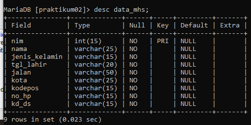
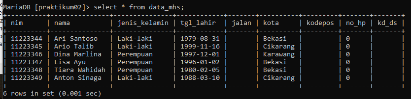
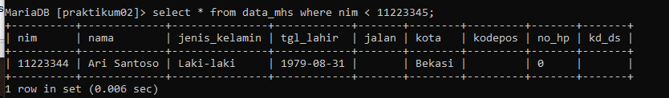
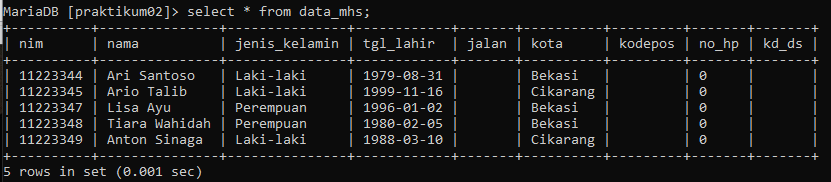
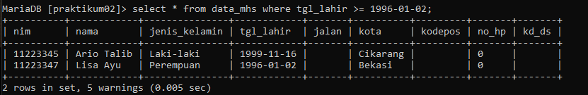
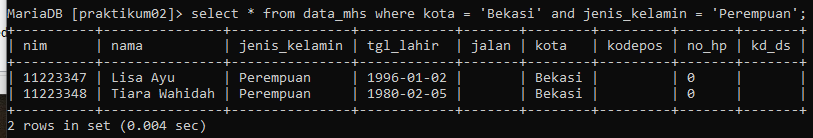
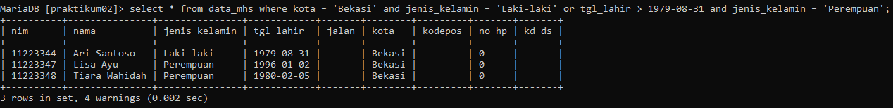
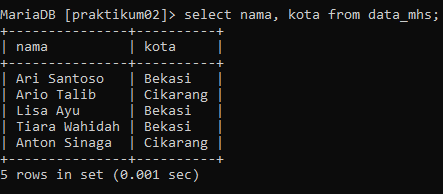
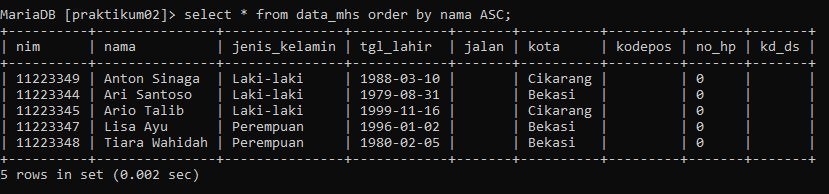

# PRAKTIKUM 2




1. Tampilkan semua isi / record tabel !
```
select * from data_mhs;
```


2. Ubah data tanggal lahir mahasiswa yang bernama Ari menjadi: 1979-08-31 !
```
update data_mhs set tgl_lahir = '1979-08-31' where nim = '11223344';
```


3. Tampilkan satu baris / record data yang telah diubah tadi !
```
select * from data_mhs where < 11223344;
```


4. Hapus data mahasiswa yang bernama Dina !
```
delete from data_mhs where nim = '11223346';
```


5. Tampilkan record / data yang tanggal kelahirannya lebih dari atau sama dengan 1996-01-02 !
```
select * from data_mhs where tgl lahir >= 1996-01-02;
```


6. Tampilkan semua Mahasiswa yang berasal dari Bekasi dan berjenis kelamin Perempuan !
```
select * from data_mhs where kota = 'Bekasi' and jenis_kelamin = 'Perempuan';
```


7. Tampilkan semua mahasiswa yang berasal dari bekasi dengan kelamin laki-laki atau mahasiswa yang berumur lebih dari 22 tahun dengan kelamin perempuan !
```
select * from data_mhs where kota = 'Bekasi' and jenis_kelamin = 'Laki-laki' or tgl_lahir > 1979-08-31 and jenis_kelamin = 'Perempuan';
```


8. Tampilkan data nama dan alamat mahasiswa saja dari tabel tersebut !
```
select nama, kota from mahasiswa;
```


9. Tampilkan data mahasiswa terurut berdasarkan nama !
```
select * from data_mhs order by nama ASC;
```


## Evaluasi dan Pertanyaan

1. Apa bedanya penggunaan BETWEEN dan penggunaan operator >= dan <= ?

• misal : tgl_lahir BETWEEN '1991-11-1' AND '1992-04-01'.

• misal : tgl_lahir >= '1991-11-1' AND tgl_lahir <= '1992-04-01'.

Kedua pernyataan tersebut memiliki makna yang sama, yaitu mencari data yang memiliki nilai tanggal lahir '1991-11-1' dan '1992-04-01'. Perbedaan hanya terletak pada sintaks penggunaanya. Penggunaan BETWEEN lebih mudah dibaca dan ditulis, sedangkan penggunaan operator >= dan <= lebih fleksibel karena dapat digunakan untuk membandingkan nilai selain tanggal.
